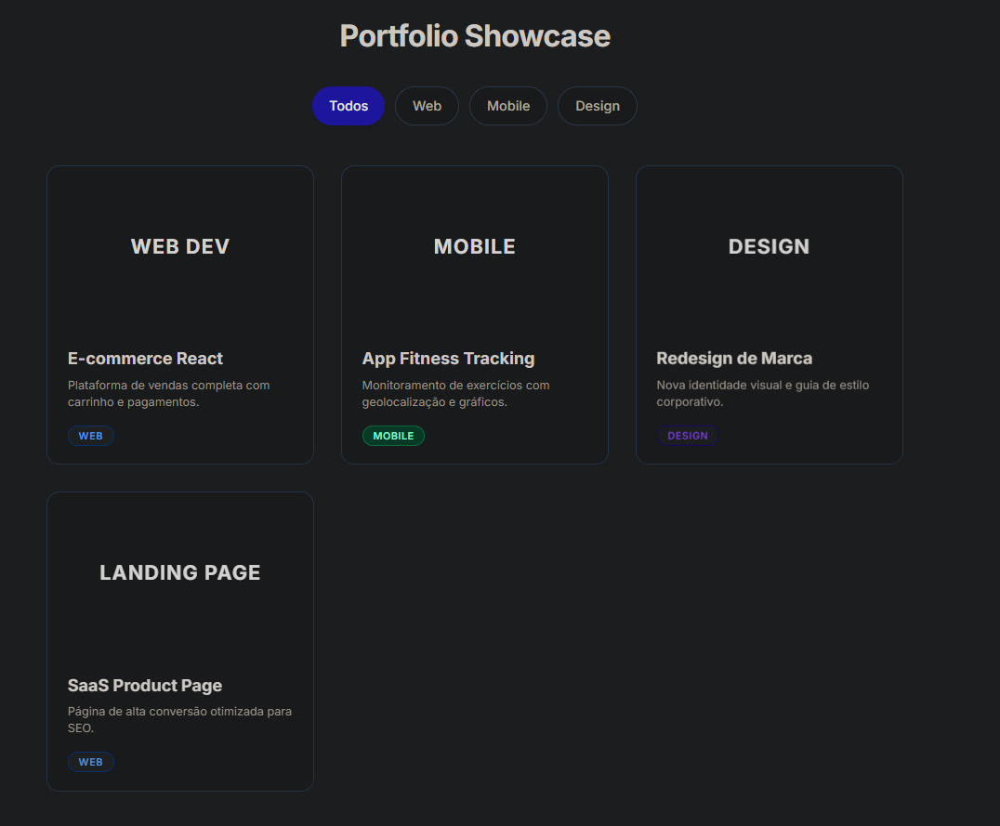

# 📂 Filtro Dinâmico de Portfólio - DOM & UI Challenge

Este projeto é uma implementação prática de manipulação de DOM aliada a um design moderno e responsivo. O objetivo foi transformar uma lista estática de projetos em uma galeria interativa e filtrável, com foco em micro-interações e feedback visual imediato.

## 🎨 Evolução do Design

O desenvolvimento seguiu uma abordagem incremental, focando primeiro na lógica e depois no refinamento visual:

### 1. Estrutura e Lógica (Logic First)
**Data Attributes:** Uso estratégico de `data-category` nos cards e `data-filter` nos botões para criar uma conexão semântica sem depender de classes CSS complexas para a lógica.
**Filtragem Nativa:** Algoritmo simples em Vanilla JS que manipula a classe utilitária `hidden` do Tailwind para alternar a visibilidade instantaneamente.

### 2. Identidade Visual (Visual Identity)
**Paleta Limpa:** - Fundo: Slate-50 (Suavidade para reduzir fadiga visual).
- Texto: Slate-800 (Alto contraste sem ser preto absoluto).
- Acento: Indigo-600 (Cor primária vibrante para indicar ação/ativo).
**Tipografia:** Uso da fonte **Inter** para garantir legibilidade moderna e profissional em diferentes tamanhos de tela.

### 3. Componentização Visual
**Botões "Pill":** Migração de botões retangulares padrão para o formato de cápsula (`rounded-full`), criando uma interface mais amigável e tátil.
**Estados de Botão:** Diferenciação clara entre botões ativos (Sólido/Indigo) e inativos (Outline/Branco), guiando o foco do usuário.

### 4. Micro-interações e Feedback (Motion)
**Hover Lift:** O card inteiro sobe ligeiramente (`-translate-y-2`) e ganha sombra (`shadow-2xl`) ao passar o mouse, criando uma sensação de "levitação".
**Zoom de Imagem:** Uso da classe `group` do Tailwind para que o hover no card acione um zoom suave (`scale-110`) apenas na área do placeholder da imagem.
**Transições Suaves:** Todas as interações possuem `transition-all duration-300` para evitar cortes secos e manter a fluidez.

## 🛠️ Tecnologias Utilizadas

- **HTML5 Semântico**
- **Tailwind CSS** (via CDN): Para estilização utilitária, layout responsivo (Grid) e animações.
- **JavaScript (Vanilla ES6+)**: Para manipulação de eventos e lógica de filtragem.
- **Google Fonts**: Tipografia Inter.

## 🚀 Como Executar

O projeto é estático e não requer instalação de dependências:

1. Clone este repositório.
2. Abra o arquivo `index.html` em seu navegador de preferência.
3. Ou acesse via **GitHub Pages** (Link do seu deploy aqui).

## 🧩 Funcionalidades Lógicas

- **Estado Ativo Único:** Lógica para garantir que apenas um botão de filtro esteja "ativo" visualmente por vez.
- **Filtragem Condicional:** Verifica se o filtro é 'all' ou corresponde à categoria específica do card.
- **Manipulação de Classes:** Adição e remoção dinâmica de classes Tailwind (`bg-indigo-600`, `text-white`, `hidden`) baseada na interação do usuário.

## 📂 Estrutura de Arquivos
/

    ├── img/
    │   ├── image.png
    ├── src/
    │   ├── script.js
    ├── index.html  
    └── README.md

---

Desenvolvido como exercício de manipulação de DOM e estilização com Tailwind CSS.